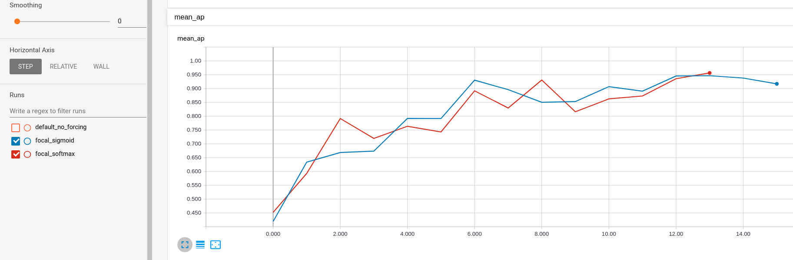

### Torch_Det_RNN

## Artisanal Research for better temporal detectors

# Features:

- [X] NEW!! very fast encode (~1ms) & decode boxes (14 ms) module (look at anchors.py)

My previous code was based on https://github.com/kuangliu/pytorch-retinanet/blob/master/encoder.py
but was much slower (~300ms ~250ms by batch) as it was really sequential.

- [X] a custom moving mnist
- [X] a custom moving coco (applying an continuous homography to the photos)
- [X] ap metric measure
- [X] recurrent retina-net
- [X] reports with tensorboard

# Coming Soon:

- [] MOT metrics
- [] COCO metrics
- [] FoveaBox Encoding/ Decoding
- [] Make "moving datasets" multithreaded using new Pytorch's IterableDataset

